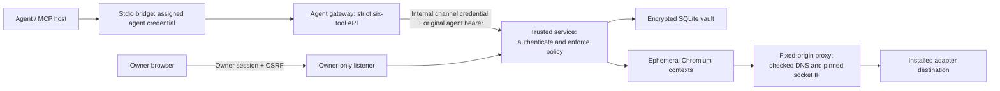

# Architecture and threat model

## Trust boundaries

The owner and trusted service are trusted. Agents and webpage content are untrusted. The gateway cannot submit an arbitrary agent ID or owner operation. The trusted service authenticates the agent verifier and rechecks account, grant version, account credential version, operation, start/expiry, vault state and session bindings before authentication, before reads and before returning data. Requests reserve bounded capacity; there is no unbounded work queue or scheduler.

The owner listener and authenticated internal listener are separate Fastify servers. Internal service credentials authenticate gateway calls; they are not owner, vault or agent credentials. The internal network in Compose has no external route. A trusted Caddy ingress joins that network and an ordinary bridge to publish loopback owner/gateway ports. Owner credentials pass through ingress, so it belongs to the trusted boundary; it has no vault or internal secret mount. Local native execution is not equivalent to separate host identities or container volume isolation. Agents must not have host-admin access, the vault volume, owner browser session, internal credential, browser debugging access or Docker socket.

## Vault and owner authentication

- Owner password is stored as an independently salted scrypt verifier, not a decryptable credential.
- Random 256-bit DEK. Passphrase KDF is Node/OpenSSL scrypt N=131072, r=8, p=1, 16-byte salt, 32-byte output, maximum memory 192 MiB.
- Key wrap and each record use AES-256-GCM with random 96-bit nonce and 128-bit tag. Associated data includes version, account UUID and credential type. Wrap and backup have different AAD domains.
- Only wrapped DEK, salt, KDF identifiers, ciphertext, nonce and tags persist. Username, account password and TOTP configuration are encrypted together. Account labels and policy metadata are not confidential vault contents; avoid sensitive labels.
- Startup is locked. Unlock deadline is absolute, configurable 60 seconds to 24 hours. Decreasing the timeout shortens the current unlock; increasing it applies at the next unlock. Lock denies new work synchronously, discards the reachable DEK buffer, cancels jobs and closes contexts. Scrypt temporary buffers are overwritten where possible.
- JavaScript strings, native browser internals, garbage collection, swap and crash dumps prevent a promise of perfect zeroization. Use full-disk encryption, restrict process debugging and manage swap/dumps at the host level.
- First setup requires a generated private token, no default passwords, exact origin/Host, JSON content type and client header. Owner writes additionally require a session-bound CSRF token. Session cookie is HttpOnly, SameSite=Strict, one-hour expiration, and Secure for HTTPS origins. Owner authentication and unlock endpoints are rate-limited and expensive operations are bounded.

## Sessions, approvals and revocation

Opaque handles are identifiers, never bearer authority on their own. Agent authentication is required on every tool call. Approvals bind stored request contents/hash, agent, account, operation, grant version, account version and deadline. A conditional database update consumes an approval once before starting authentication. Idempotency conflicts are rejected.

Sessions are ephemeral browser contexts; no persistent profile, cookie export, tracing, video, raw HTML or debug port. On revocation, synchronous state updates deny subsequent work before asynchronous cleanup. Active work is aborted when possible. The trusted service checks authorization again before returning operation results. Remote logout is attempted through the installed adapter where feasible and reported as confirmed or not_confirmed. Local closure does not prove every remote server token was invalidated. Revocation cannot retract information already delivered.

## Networking

Browser routes restrict exact origins, including redirected/subresource requests. Service workers are blocked; WebSockets and popups are closed. Chromium uses a fixed-destination proxy with loopback bypass disabled, QUIC disabled and non-proxied WebRTC UDP disabled. The proxy resolves DNS for each connection, rejects private, loopback, link-local, carrier-grade NAT, multicast and reserved destinations for external connections, and connects to the exact checked IP. HTTPS CONNECT preserves browser certificate verification. The normal external policy never permits HTTP. Only the explicitly enabled fixture origin has a local exception.

No external adapter is installed. The network regression suite covers explicit URL/IP and proxy cases, not an independent assessment of every browser/network exploit. Chromium and Node vulnerabilities remain dependencies on timely security updates. Browser compromise in the trusted worker is a serious residual risk: the worker and vault share a process/container trust domain. A future isolation improvement could split decryption and per-session workers into separate confined processes. A malicious host administrator defeats all these software boundaries.

## Explicit limitations

Unattended use of both password and TOTP no longer preserves an independent human approval factor. Grant approval is a Broker policy decision, not a replacement for a service's push approval, CAPTCHA, security-key touch or other required step. Unsupported challenges return human_action_required; they are never bypassed.

Audit records are ordinary local SQLite records, not tamper-proof logs. They omit credentials, codes, cookies, raw pages and invoice contents. Agent-provided reasons are stored as untrusted text in requests and displayed using React escaping; do not put secrets in reasons. No external telemetry is enabled. Backup theft enables offline attacks against the vault passphrase; use a strong unique passphrase. Old backups retain old access metadata and old wrapping passphrases.

A Codex Security static review used an independent AI baseline auditor, architecture reviewer and focused policy review. It reported no substantiated vulnerabilities in the reviewed fixture implementation. See docs/VERIFICATION.md for its snapshot, exclusions and subsequent correctness fixes. This is not an independent professional security audit or penetration test. Real accounts require an actual verified adapter and deployment environment.
